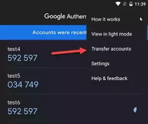
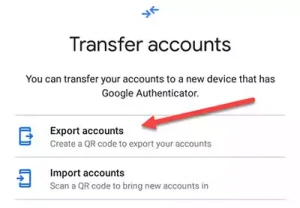
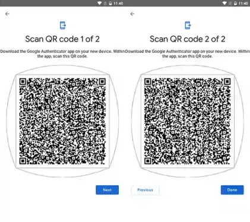

# Extract TOTP/HOTP secrets from QR codes exported by two-factor authentication apps

[](https://github.com/scito/extract_otp_secrets/actions/workflows/ci.yml)
[](https://github.com/scito/extract_otp_secrets/actions/workflows/ci_docker.yml)

[](https://github.com/scito/extract_otp_secrets/blob/master/LICENSE)
[](https://github.com/scito/extract_otp_secrets/releases/latest)  

[](https://hub.docker.com/repository/docker/scit0/extract_otp_secrets/general)
[](https://github.com/scito/extract_otp_secrets/releases/latest)
[](https://github.com/scito/extract_otp_secrets/releases/latest)
[](https://github.com/scito/extract_otp_secrets/releases/latest)
[](https://github.com/scito/extract_otp_secrets/releases/latest)  
[](https://stand-with-ukraine.pp.ua)
<!-- 
[](https://github.com/scito/extract_otp_secrets/blob/master/Pipfile.lock)
-->

<!-- [](https://GitHub.com/scito/extract_otp_secrets/releases/) -->

---

The Python script `extract_otp_secrets.py` extracts one time password (OTP) secrets from QR codes exported by two-factor authentication (2FA) apps such as "Google Authenticator".
The exported QR codes from authentication apps can be read in three ways:

1. Capture the QR codes with the system camera using a GUI, 🆕
2. Read image files containing the QR codes, and 🆕
3. Read text files containing the QR code data generated by third-party QR readers.

The secrets can be exported to JSON or CSV, or printed as QR codes to console or saved as PNG.

⚡ **This project/script was renamed from `extract_otp_secret_keys` to `extract_otp_secrets`.** ⚡

<details>
<summary>Table of contents</summary>

## Table of contents

- [Download and run binary executable (🆕 since v2.1)](#download-and-run-binary-executable--since-v21)
  - [MacOS application](#macos-application)
- [Usage](#usage)
  - [Capture QR codes from camera (🆕 since version 2.0)](#capture-qr-codes-from-camera--since-version-20)
  - [With builtin QR decoder from image files (🆕 since version 2.0)](#with-builtin-qr-decoder-from-image-files--since-version-20)
  - [With external QR decoder app from text files](#with-external-qr-decoder-app-from-text-files)
- [Installation of Python script (recommended for developers or advanced users)](#installation-of-python-script-recommended-for-developers-or-advanced-users)
  - [Installation of optional shared system libraries (recommended)](#installation-of-optional-shared-system-libraries-recommended)
- [Program help: arguments and options](#program-help-arguments-and-options)
- [Examples](#examples)
  - [Printing otp secrets from text file](#printing-otp-secrets-form-text-file)
  - [Printing otp secrets from image file](#printing-otp-secrets-from-image-file)
  - [Writing otp secrets to csv file](#writing-otp-secrets-to-csv-file)
  - [Writing otp secrets to json file](#writing-otp-secrets-to-json-file)
  - [Printing otp secrets multiple files](#printing-otp-secrets-multiple-files)
  - [Printing otp secrets from stdin (text)](#printing-otp-secrets-from-stdin-text)
  - [Printing otp secrets from stdin (image)](#printing-otp-secrets-from-stdin-image)
  - [Printing otp secrets csv to stdout](#printing-otp-secrets-csv-to-stdout)
  - [Printing otp secrets csv to stdout without header line](#printing-otp-secrets-csv-to-stdout-without-header-line)
  - [Reading from stdin and printing to stdout](#reading-from-stdin-and-printing-to-stdout)
- [Features](#features)
- [KeePass](#keepass)
- [How to export otp secrets from Google Authenticator app](#how-to-export-otp-secrets-from-google-authenticator-app)
- [Glossary](#glossary)
- [Alternative installation methods](#alternative-installation-methods)
  - [pip using github](#pip-using-github)
  - [local pip](#local-pip)
  - [pipenv](#pipenv)
  - [Visual Studio Code Remote - Containers / VSCode devcontainer](#visual-studio-code-remote---containers--vscode-devcontainer)
  - [venv](#venv)
  - [devbox](#devbox)
  - [docker](#docker)
  - [More docker examples](#more-docker-examples)
- [Tests](#tests)
  - [PyTest](#pytest)
  - [unittest](#unittest)
  - [VSCode Setup](#vscode-setup)
- [Development](#development)
  - [Build](#build)
  - [Upgrade pip Packages](#upgrade-pip-packages)
  - [Build docker images](#build-docker-images)
  - [Create executables with pyinstaller](#create-executables-with-pyinstaller)
  - [Full local build (bash)](#full-local-build-bash)
- [Technical background](#technical-background)
- [References](#references)
- [Issues](#issues)
- [Problems and Troubleshooting](#problems-and-troubleshooting)
  - [Windows error message](#windows-error-message)
- [Related projects](#related-projects)
</details>

## Download and run binary executable (🆕 since v2.1)

1. Download executable for your platform from [latest release](https://github.com/scito/extract_otp_secrets/releases/latest), see assets
2. Linux and macOS: Set executable bit for the downloaded file, e.g in terminal with `chmod +x extract_otp_secrets_OS_vX.X.X`
3. Start executable by clicking or from command line (macOS: startable only from command line, see [below](#macOS-application))

:heavy_check_mark: Everything is just packed in one executable.  
:heavy_check_mark: No installation needed, neither Python nor any dependencies have to be installed.  
:heavy_check_mark: Easy and convenient  

:information_source: There is a delay after starting the executable since the files have internally to be unpacked.

:information_source: If you are a developer, you might prefer to run the Python script directly, see [Installation](#installation-of-python-script-recommended-for-developers-or-advanced-users)

> :warning: Some antivirus tools may show a virus or trojan alert for the executable.
> This alert is a false positive.
> This is a known problem for executables generated by PyInstaller.
> If you have any doubt, please use directly the [Python script](#installation-of-python-script-recommended-for-developers-or-advanced-users).

:information_source: The executables are not signed. Thus, the operating system may show a warning about download from unknown source.

### MacOS application

> Beginning in macOS 10.15, all software built after June 1, 2019, and distributed with Developer ID must be notarized. However, you aren’t required to notarize software that you distribute through the Mac App Store because the App Store submission process already includes equivalent security checks. <small>[developer.apple.com](https://developer.apple.com/documentation/security/notarizing_macos_software_before_distribution)</small>

:x: Unfortunately, I cannot provide a signed and notarized installable application for macOS as .dmg or .pkg. Apple is not Open Source friendly and requires a yearly Developer ID subscription. I am not willing to pay [USD 99 per year](https://developer.apple.com/support/compare-memberships/) to Apple for this little open source tool.

However, the bare executable can be executed from the command line:

1. Download executable for macOS platform from [latest release](https://github.com/scito/extract_otp_secrets/releases/latest), see assets
2. Open Terminal application
3. Change to Downloads: `cd $HOME/Downloads`
4. Set executable bit for the downloaded file: `chmod +x extract_otp_secrets_OS_vX.X.X`
5. Start executable from command line: `./extract_otp_secrets_OS_vX.X.X`

## Usage

### Capture QR codes from camera (🆕 since version 2.0)

1. Open "Google Authenticator" app on the mobile phone
2. Export the QR codes from "Google Authenticator" app (see [how to export](#how-to-export-otp-secrets-from-google-authenticator-app))
3. Point the exported QR codes to the camera of your computer
4. Run the program without infile parameters:
```
extract_otp_secrets
```


Detected QR codes are surrounded with a frame. The color of the frame indicates the extracting result:

* Green: The QR code is detected, decoded and the OTP secret was successfully extracted.
* Red: The QR code is detected and decoded, but could not be successfully extracted. This is the case if a QR code not containing OTP data is captured.
* Magenta: The QR code is detected, but could not be decoded. The QR code should be presented better to the camera or another QR reader could be used.

Key commands:

* Space: change QR code reader
* C: save as csv file (🆕 since v2.2)
* J: save as json file (🆕 since v2.2)
* K: save as KeePass csv file (🆕 since v2.2)
* ESC, ENTER, Q: quit the program

The secrets are printed by default to the console. [Set program parameters](#program-help-arguments-and-options) for other types of output, e.g. `--csv exported_secrets.csv`.

### With builtin QR decoder from image files (🆕 since version 2.0)

1. Open "Google Authenticator" app on the mobile phone
2. Export the QR codes from "Google Authenticator" app (see [how to export](#how-to-export-otp-secrets-from-google-authenticator-app))
3. Save the QR code as image file, e.g. example_export.png
4. Transfer the images files to the computer where his script is installed.
5. Call this script with the file as input:
```
extract_otp_secrets example_export.png
```
6. Remove unencrypted files with secrets from your computer and mobile.

### With external QR decoder app from text files

1. Open "Google Authenticator" app on the mobile phone
2. Export the QR codes from "Google Authenticator" app (see [how to export](#how-to-export-otp-secrets-from-google-authenticator-app))
3. Read QR codes with a third-party QR code reader (e.g. from another phone)
4. Save the captured QR codes from the QR code reader to a text file, e.g. example_export.txt. Save each QR code on a new line. (The captured QR codes look like `otpauth-migration://offline?data=…`)
5. Transfer the file to the computer where his script is installed.
6. Call this script with the file as input:
```
extract_otp_secrets example_export.txt
```
7. Remove unencrypted files with secrets from your computer and mobile.

## Installation of Python script (recommended for developers or advanced users)

```bash
git clone https://github.com/scito/extract_otp_secrets.git
cd extract_otp_secrets
pip install -U -r requirements.txt

python src/extract_otp_secrets.py example_export.txt
```

In case this script is not starting properly, the debug mode can be activated by adding parameter `-d` in the command line.

### Installation of optional shared system libraries (recommended)

For reading QR codes with `ZBAR` QR reader, the zbar library must be installed.
If you do not use the `ZBAR` QR reader, you do not need to install the zbar shared library. Note: The `ZBAR` QR reader is the showed for me the best results and is thus default QR Reader.

For a detailed installation documentation of [pyzbar](https://github.com/NaturalHistoryMuseum/pyzbar#installation).

#### Linux (Debian, Ubuntu, …)

    sudo apt-get install libzbar0

#### Linux (OpenSUSE)

    sudo zypper install libzbar0

#### Linux (Fedora)

    sudo dnf install libzbar0

#### Linux (Arch Linux)

    pacman -S zbar

#### Mac OS X

    brew install zbar

#### Windows

##### zbar

The zbar DLLs are included with the Windows Python wheels. However, you might need additionally to install [Visual C++ Redistributable Packages for Visual Studio 2013](https://www.microsoft.com/en-US/download/details.aspx?id=40784). Install `vcredist_x64.exe` if using 64-bit Python, `vcredist_x86.exe` if using 32-bit Python. For more information see [pyzbar](https://github.com/NaturalHistoryMuseum/pyzbar)

##### OpenCV (CV2)

OpenCV requires [Visual C++ redistributable 2015](https://www.microsoft.com/en-us/download/details.aspx?id=48145). For more information see [opencv-python](https://pypi.org/project/opencv-python/)

## Program help: arguments and options

<pre>usage: extract_otp_secrets.py [-h] [--csv FILE] [--keepass FILE] [--json FILE] [--txt FILE] [--printqr] [--saveqr DIR] [--camera NUMBER] [--qr {ZBAR,QREADER,QREADER_DEEP,CV2,CV2_WECHAT}] [-i] [--no-color] [--version] [-d | -v | -q] [infile ...]

Extracts one time password (OTP) secrets from QR codes exported by two-factor authentication (2FA) apps
If no infiles are provided, a GUI window starts and QR codes are captured from the camera.

positional arguments:
  infile                        a) file or - for stdin with 'otpauth-migration://...' URLs separated by newlines, lines starting with # are ignored;
                                b) image file containing a QR code or = for stdin for an image containing a QR code

options:
  -h, --help                    show this help message and exit
  --csv FILE, -c FILE           export csv file or - for stdout
  --keepass FILE, -k FILE       export totp/hotp csv file(s) for KeePass, - for stdout
  --json FILE, -j FILE          export json file or - for stdout
  --txt FILE, -t FILE           export txt file or - for stdout
  --printqr, -p                 print QR code(s) as text to the terminal
  --saveqr DIR, -s DIR          save QR code(s) as images to directory
  --camera NUMBER, -C NUMBER    camera number of system (default camera: 0)
  --qr {ZBAR,QREADER,QREADER_DEEP,CV2,CV2_WECHAT}, -Q {ZBAR,QREADER,QREADER_DEEP,CV2,CV2_WECHAT}
                                QR reader (default: ZBAR)
  -i, --ignore                  ignore duplicate otps
  --no-color, -n                do not use ANSI colors in console output
  --version, -V                 print version and quit
  -d, --debug                   enter debug mode, do checks and quit
  -v, --verbose                 verbose output
  -q, --quiet                   no stdout output, except output set by -

examples:
python extract_otp_secrets.py
python extract_otp_secrets.py example_*.txt
python extract_otp_secrets.py - < example_export.txt
python extract_otp_secrets.py --csv - example_*.png | tail -n+2
python extract_otp_secrets.py = < example_export.png</pre>

## Examples

### Printing otp secrets form text file

    python src/extract_otp_secrets.py example_export.txt

### Printing otp secrets from image file

    python src/extract_otp_secrets.py example_export.png

### Writing otp secrets to csv file

    python src/extract_otp_secrets.py -q --csv extracted_secrets.csv example_export.txt

### Writing otp secrets to json file

    python src/extract_otp_secrets.py -q --json extracted_secrets.json example_export.txt

### Printing otp secrets multiple files

    python src/extract_otp_secrets.py example_*.txt
    python src/extract_otp_secrets.py example_*.png
    python src/extract_otp_secrets.py example_export.*
    python src/extract_otp_secrets.py example_*.txt example_*.png

### Printing otp secrets from stdin (text)

    python src/extract_otp_secrets.py - < example_export.txt

### Printing otp secrets from stdin (image)

    python src/extract_otp_secrets.py = < example_export.png

### Printing otp secrets csv to stdout

    python src/extract_otp_secrets.py --csv - example_export.txt

### Printing otp secrets csv to stdout without header line

    python src/extract_otp_secrets.py --csv - example_*.png | tail -n+2

### Reading from stdin and printing to stdout

    cat example_*.txt | python src/extract_otp_secrets.py --csv - - | tail -n+2

## Features

* Free and open source
* Supports Google Authenticator exports (and compatible apps like Aegis Authenticator)
* Captures the the QR codes directly from the camera using different QR code libraries (based on OpenCV) (🆕 since v2.0)
    * ZBAR: [pyzbar](https://github.com/NaturalHistoryMuseum/pyzbar) - fast and reliable, good for images and video capture (default and recommended) [if [libzbar](#installation-of-optional-shared-system-libraries-recommended) is installed]
    * QREADER: [QReader](https://github.com/Eric-Canas/QReader) [if [libzbar](#installation-of-optional-shared-system-libraries-recommended) is installed]
    * QREADER_DEEP: [QReader](https://github.com/Eric-Canas/QReader) - very slow in GUI [if [libzbar](#installation-of-optional-shared-system-libraries-recommended) is installed]
    * CV2: [QRCodeDetector](https://docs.opencv.org/4.x/de/dc3/classcv_1_1QRCodeDetector.html)
    * CV2_WECHAT: [WeChatQRCode](https://docs.opencv.org/4.x/dd/d63/group__wechat__qrcode.html)
* Program usable as pure GUI application without any command line switches (🆕 since v2.2)
    * Save otp secrets as csv file (🆕 since v2.2)
    * Save otp secrets as json file (🆕 since v2.2)
    * Save otp secrets as KeePass csv file(s) (🆕 since v2.2)
* Supports [TOTP](https://www.ietf.org/rfc/rfc6238.txt) and [HOTP](https://www.ietf.org/rfc/rfc4226.txt) standards
* Generates QR codes
* Exports to various formats:
    * CSV
    * JSON
    * Dedicated CSV for KeePass
    * QR code images
* Supports reading from stdin and writing to stdout, thus pipes can be used
* Handles multiple input files (🆕 since v2.0)
* Reads QR codes images: (See [OpenCV docu](https://docs.opencv.org/4.x/d4/da8/group__imgcodecs.html#ga288b8b3da0892bd651fce07b3bbd3a56)) (🆕 since v2.0)
    * Portable Network Graphics - *.png
    * WebP - *.webp
    * JPEG files - *.jpeg, *.jpg, *.jpe
    * TIFF files - *.tiff, *.tif
    * Windows bitmaps - *.bmp, *.dib
    * JPEG 2000 files - *.jp2
    * Portable image format - *.pbm, *.pgm, *.ppm *.pxm, *.pnm
* Prints errors and warnings to stderr (🆕 since v2.0)
* Prints colored output (🆕 since v2.0)
* Startable as executable (script, Python, and all dependencies packed in one executable) (🆕 since v2.1)
    * extract_otp_secrets_linux_x86_64 (requires glibc >= 2.28)
    * extract_otp_secrets_linux_arm64 (requires glibc >= 2.28)
    * extract_otp_secrets_win_x86_64.exe
    * extract_otp_secrets_macos_x86_64 (optional [libzbar](#installation-of-optional-shared-system-libraries-recommended) needs to be installed manually if needed)
        * extract_otp_secrets_macos_x86_64.dmg N/A, see [why](#macos-application)
        * extract_otp_secrets_macos_x86_64.pkg N/A, see [why](#macos-application)
* Prebuilt Docker images provided for amd64 and arm64 (🆕 since v2.0)
* Many ways to run the script:
    * Native Python
    * pipenv
    * pip
    * venv
    * Docker
    * VSCode devcontainer
    * devbox
* Compatible with major platforms:
    * Linux
    * macOS
    * Windows
* Uses UTF-8 on all platforms
* Supports Python >= 3.7
* Installation of shared system libraries is optional (🆕 since v2.3)
* Provides a debug mode (-d) for analyzing import problems
* Written in modern Python using type hints and following best practices
* All these features are backed by tests ran nightly
* All functionality in one Python script: src/extract_otp_secrets.py (except protobuf generated code in protobuf_generated_python)

## KeePass

[KeePass 2.51](https://keepass.info/news/n220506_2.51.html) (released in May 2022) and newer [support the generation of OTPs (TOTP and HOTP)](https://keepass.info/help/base/placeholders.html#otp).

KeePass can generate the second factor password (2FA) if the OTP secret is stored in `TimeOtp-Secret-Base32` string field for TOTP or `HmacOtp-Secret-Base32` string field for HOTP. You view or edit them in entry dialog on the 'Advanced' tab page.

KeePass provides menu commands in the main window for generating one-time passwords ('Copy HMAC-Based OTP', 'Show HMAC-Based OTP', 'Copy Time-Based OTP', 'Show Time-Based OTP'). Furthermore, one-time passwords can be generated during auto-type using the {HMACOTP} and {TIMEOTP} placeholders.

In order to simplify the usage of the second factor password generation in KeePass a specific KeePass CSV export is available with option `-keepass` or `-k`. This KeePass CSV file can be imported by the ["Generic CSV Importer" of KeePass](https://keepass.info/help/kb/imp_csv.html).

If TOTP and HOTP entries have to be exported, then two files with an intermediate suffix .totp or .hotp will be added to the KeePass export filename.

Example:
- Only TOTP entries to export and parameter --keepass example_keepass_output.csv<br>
    → example_keepass_output.csv with TOTP entries will be exported
- Only HOTP entries to export and parameter --keepass example_keepass_output.csv<br>
    → example_keepass_output.csv with HOTP entries will be exported
- If both TOTP and HOTP entries to export and parameter --keepass example_keepass_output.csv<br>
    → example_keepass_output.totp.csv with TOTP entries will be exported<br>
    → example_keepass_output.hotp.csv with HOTP entries will be exported

Import CSV with TOTP entries in KeePass as

- Title
- User Name
- String (TimeOtp-Secret-Base32)
- Group (/)

Import CSV with HOTP entries in KeePass as

- Title
- User Name
- String (HmacOtp-Secret-Base32)
- String (HmacOtp-Counter)
- Group (/)

KeePass can be used as a backup for one time passwords (second factor) from the mobile phone.

## How to export otp secrets from Google Authenticator app

1. Open "Google Authenticator" app
2. Select "Transfer accounts" in the three dot menu of the app.  

3. Select "Export accounts"  

4. Pass the verification by password or fingerprint.
5. Select your accounts
6. Press "Next" button
7. The exported QR code(s) ready for extraction are shown.  


## Glossary

* OTP = One-time password
* TOTP = Time-based one-time password
* HOTP = HMAC-based one-time password (using a counter)
* 2FA = Second factor authentication
* TFA = Two factor authentication
* QR code = Quick response code

## Alternative installation methods

### pip using github

```
pip install -U git+https://github.com/scito/extract_otp_secrets
extract_otp_secrets
```

or run it

```
python -m extract_otp_secrets
```

or from a specific tag

```
pip install -U git+https://github.com/scito/extract_otp_secrets.git@v2.0.0
extract_otp_secrets
curl -s https://raw.githubusercontent.com/scito/extract_otp_secrets/master/example_export.txt | python -m extract_otp_secrets -
```

### local pip

```
git clone https://github.com/scito/extract_otp_secrets.git
pip install -U -e extract_otp_secrets
extract_otp_secrets extract_otp_secrets/example_export.txt
```

or run it

```
python -m extract_otp_secrets extract_otp_secrets/example_export.txt
```

### pipenv

You can you use [Pipenv](https://github.com/pypa/pipenv) for running extract_otp_secrets.

```
pipenv --rm
pipenv install
pipenv shell
python src/extract_otp_secrets.py example_export.txt
```

### Visual Studio Code Remote - Containers / VSCode devcontainer

You can you use [VSCode devcontainer](https://code.visualstudio.com/docs/remote/containers-tutorial) for running extract_otp_secrets.

Requirement: Docker

1. Start VSCode
2. Open extract_otp_secrets.code-workspace
3. Open VSCode command palette (Ctrl-Shift-P)
4. Type command "Remote-Containers: Reopen in Container"
5. Open integrated bash terminal in VSCode
6. Execute: python src/extract_otp_secrets.py example_export.txt

### venv

Alternatively, you can use a python virtual env for the dependencies:

    python -m venv venv
    . venv/bin/activate
    pip install -U -r requirements-dev.txt
    pip install -U -r requirements.txt

The requirements\*.txt files contain all the dependencies (also the optional ones).
To leave the python virtual env just call `deactivate`.

### devbox

Install [devbox](https://github.com/jetpack-io/devbox), which is a wrapper for nix. Then enter the environment with Python and the packages installed with:

```
devbox shell
```

### docker

Install [Docker](https://docs.docker.com/get-docker/).

Prebuilt docker images are available for amd64 and arm64 architectures on [Docker Hub](https://hub.docker.com/repository/docker/scit0/extract_otp_secrets) and on [GitHub Packages](https://github.com/users/scito/packages/container/package/extract_otp_secrets).

Extracting from an QR image file:

```
curl -s https://raw.githubusercontent.com/scito/extract_otp_secrets/master/example_export.png | docker run --pull always -i --rm -v "$(pwd)":/files:ro scit0/extract_otp_secrets =
```

Capturing from camera in GUI window (X Window system required on host):

```
docker run --pull always --rm -v "$(pwd)":/files:ro -i --device="/dev/video0:/dev/video0" --env="DISPLAY" -v /tmp/.X11-unix:/tmp/.X11-unix:ro scit0/extract_otp_secrets
```

If only text processing is required, there is a small Image based on Alpine Linux:

```
curl -s https://raw.githubusercontent.com/scito/extract_otp_secrets/master/example_export.txt | docker run --pull always -i --rm -v "$(pwd)":/files:ro scit0/extract_otp_secrets:latest-only-txt -
```

Docker image from GitHub:

```
docker login ghcr.io -u USERNAME
curl -s https://raw.githubusercontent.com/scito/extract_otp_secrets/master/example_export.png | docker run --pull always -i --rm -v "$(pwd)":/files:ro ghcr.io/scito/extract_otp_secrets =
```

### More docker examples

    docker run --pull always --rm -v "$(pwd)":/files:ro scit0/extract_otp_secrets example_export.png

    docker run --pull always --rm -i -v "$(pwd)":/files:ro scit0/extract_otp_secrets_only_txt - < example_export.txt

    cat example_export.txt | docker run --pull always --rm -i -v "$(pwd)":/files:ro scit0/extract_otp_secrets:latest_only_txt - -c - > example_out.csv

## Tests

### PyTest

The script is covered by [pytest](https://pytest.org)s, see `extract_otp_secrets_test.py`.

Run tests:

```
pytest
```
or
```
python -m pytest
```

#### Hints

Your tests can run against an installed version after executing pip install .

Your tests can run against the local copy with an editable install after executing pip install --editable .

If you don’t use an editable install and are relying on the fact that Python by default puts the current directory in sys.path to import your package, you can execute python -m pytest to execute the tests against the local copy directly, without using pip.

https://docs.pytest.org/en/7.1.x/explanation/pythonpath.html#pytest-vs-python-m-pytest

### unittest

There are some [unittest](https://docs.python.org/3.10/library/unittest.html)s, see `extract_otp_secrets_txt_unit_test.py`.

Run tests:

```
python -m unittest
```

Note the `pytest`s are preferred and complete. For each unittest there is also a test in `pytest`.

### VSCode Setup

Setup for running the tests in VSCode.

1. Open VSCode command palette (Ctrl-Shift-P)
2. Type command "Python: Configure Tests"
3. Choose unittest or pytest. (pytest is recommended, both are supported)
4. Set ". Root" directory

## Development

### Build

```
cd extract_otp_secrets/
pip install -U -e .
python src/extract_otp_secrets.py

pip wheel .
```

Note: `python -m build --wheel` = `pip wheel --no-deps .`

### Upgrade pip Packages

```
pip install -U -r requirements.txt
```

### Build docker images

#### Debian (full functionality)

Build and run the app within the container:

```bash
docker build . -t extract_otp_secrets --pull --build-arg RUN_TESTS=false
```

Run tests in docker container:

```bash
docker run --entrypoint /extract/run_pytest.sh --rm -v "$(pwd)":/files:ro extract_otp_secrets
```

#### Alpine (only text file processing)

```bash
docker build . -t extract_otp_secrets:only_txt --pull -f Dockerfile_only_txt --build-arg RUN_TESTS=false
```

Run tests in docker container:

```bash
docker run --entrypoint /extract/run_pytest.sh --rm -v "$(pwd)":/files:ro extract_otp_secrets_only_txt extract_otp_secrets_test.py -k "not qreader" --relaxed
```

### Create executables with pyinstaller

#### Linux

```bash
pyinstaller -y --add-data $pythonLocation/__yolo_v3_qr_detector/:__yolo_v3_qr_detector/ --onefile src/extract_otp_secrets.py
```

Output is executable `dist/extract_otp_secrets`

#### Windows

```
pyinstaller -y --add-data "%pythonLocation%\__yolo_v3_qr_detector;__yolo_v3_qr_detector" --add-binary "%pythonLocation%\pyzbar\libiconv.dll;pyzbar" --add-binary "%pythonLocation%\pyzbar\libzbar-64.dll;pyzbar" --add-binary "%windir%\system32\msvcr120.dll;pyzbar" --add-binary "%windir%\system32\msvcp120.dll;pyzbar" --add-binary "%windir%\system32\vcamp120.dll;pyzbar" --add-binary "%windir%\system32\vcomp120.dll;pyzbar" --add-binary "%windir%\system32\vccorlib120.dll;pyzbar" --add-binary "%windir%\system32\mfc120.dll;pyzbar" --add-binary "%windir%\system32\mfc120u.dll;pyzbar" --add-binary "%windir%\system32\mfc120chs.dll;pyzbar" --add-binary "%windir%\system32\mfc120cht.dll;pyzbar" --add-binary "%windir%\system32\mfc120deu.dll;pyzbar" --add-binary "%windir%\system32\mfc120enu.dll;pyzbar" --add-binary "%windir%\system32\mfc120esn.dll;pyzbar" --add-binary "%windir%\system32\mfc120fra.dll;pyzbar" --add-binary "%windir%\system32\mfc120ita.dll;pyzbar" --add-binary "%windir%\system32\mfc120jpn.dll;pyzbar" --add-binary "%windir%\system32\mfc120kor.dll;pyzbar" --add-binary "%windir%\system32\mfc120rus.dll;pyzbar" --onefile --version-file build\file_version_info.txt src\extract_otp_secrets.py
```

Output is `dist\extract_otp_secrets.exe`

### Full local build (bash)

There is a Bash script for a full local build including linting and type checking.

```bash
./build.sh
```

The options of the build script:

```
Build extract_otp_secrets project

./build.sh [options]

Options:
-i                      Interactive mode, all steps must be confirmed
-C                      Ignore version check of protobuf/protoc
-D                      Do not build docker
-G                      Do not start extract_otp_secrets.py in GUI mode
-c                      Clean everything
-r                      Generate result files
-h, --help              Help
```

## Technical background

The export QR code of "Google Authenticator" contains the URL `otpauth-migration://offline?data=…`.
The data parameter is a base64 encoded proto3 message (Google Protocol Buffers).

Command for regeneration of Python code from proto3 message definition file (only necessary in case of changes of the proto3 message definition or new protobuf versions):

    protoc --plugin=protoc-gen-mypy=path/to/protoc-gen-mypy --python_out=src/protobuf_generated_python --mypy_out=src/protobuf_generated_python src/google_auth.proto

The generated protobuf Python code was generated by protoc 22.0 (https://github.com/protocolbuffers/protobuf/releases/tag/v22.0).

For Python type hint generation the [mypy-protobuf](https://github.com/nipunn1313/mypy-protobuf) package is used.

## References

* Proto3 documentation: https://developers.google.com/protocol-buffers/docs/pythontutorial
* Template code: https://github.com/beemdevelopment/Aegis/pull/406

## Issues

* Segmentation fault on macOS with CV2 4.7.0: https://github.com/opencv/opencv/issues/23072
* CV2 window does not show icons: https://github.com/opencv/opencv-python/issues/585

## Problems and Troubleshooting

### Windows error message

If you see an ugly ImportError on Windows you will most likely need the [Visual C++ Redistributable Packages for Visual Studio 2013](https://www.microsoft.com/en-US/download/details.aspx?id=40784). Install vcredist_x64.exe if using 64-bit Python, vcredist_x86.exe if using 32-bit Python.

This library shared library is required by [pyzbar](https://pypi.org/project/pyzbar/).

```
Traceback (most recent call last):
  File "C:\Users\Admin\AppData\Local\Packages\PythonSoftwareFoundation.Python.3.11_qbz5n2kfra8p0\LocalCache\local-packages\Python311\site-packages\pyzbar\zbar_library.py", line 58, in load
    dependencies, libzbar = load_objects(Path(''))
                            ^^^^^^^^^^^^^^^^^^^^^^
  File "C:\Users\Admin\AppData\Local\Packages\PythonSoftwareFoundation.Python.3.11_qbz5n2kfra8p0\LocalCache\local-packages\Python311\site-packages\pyzbar\zbar_library.py", line 50, in load_objects
    deps = [
           ^
  File "C:\Users\Admin\AppData\Local\Packages\PythonSoftwareFoundation.Python.3.11_qbz5n2kfra8p0\LocalCache\local-packages\Python311\site-packages\pyzbar\zbar_library.py", line 51, in <listcomp>
    cdll.LoadLibrary(str(directory.joinpath(dep)))
  File "C:\Program Files\WindowsApps\PythonSoftwareFoundation.Python.3.11_3.11.496.0_x64__qbz5n2kfra8p0\Lib\ctypes\__init__.py", line 454, in LoadLibrary
    return self._dlltype(name)
           ^^^^^^^^^^^^^^^^^^^
  File "C:\Program Files\WindowsApps\PythonSoftwareFoundation.Python.3.11_3.11.496.0_x64__qbz5n2kfra8p0\Lib\ctypes\__init__.py", line 376, in __init__
    self._handle = _dlopen(self._name, mode)
                   ^^^^^^^^^^^^^^^^^^^^^^^^^
FileNotFoundError: Could not find module 'libiconv.dll' (or one of its dependencies). Try using the full path with constructor syntax.
```

## Related projects

* [ZBar](https://github.com/mchehab/zbar) is an open source software suite for reading bar codes from various sources, including webcams.
* [Aegis Authenticator](https://github.com/beemdevelopment/Aegis) is a free, secure and open source 2FA app for Android.
* [pyzbar](https://github.com/NaturalHistoryMuseum/pyzbar) is a good QR code reader Python module
* [OpenCV](https://docs.opencv.org/4.x/) (CV2) Open Source Computer Vision library with [opencv-python](https://github.com/opencv/opencv-python)
* [Python QReader](https://github.com/Eric-Canas/QReader) Python QR code readers
* [Android OTP Extractor](https://github.com/puddly/android-otp-extractor) can extract your tokens from popular Android OTP apps and export them in a standard format or just display them as QR codes for easy importing. [Requires a _rooted_ Android phone.]
* [Google Authenticator secret extractor](https://github.com/krissrex/google-authenticator-exporter) is similar project written in JavaScript. It also extracts otp secrets from Google Authenticator.

***

# #StandWithUkraine 🇺🇦

#RussiaInvadedUkraine on 24 of February 2022, at 05:00 the armed forces of the Russian Federation attacked Ukraine. Please, stand with Ukraine, stay tuned for updates on Ukraine's official sources and channels in English and support Ukraine in its fight for freedom and democracy in Europe.
